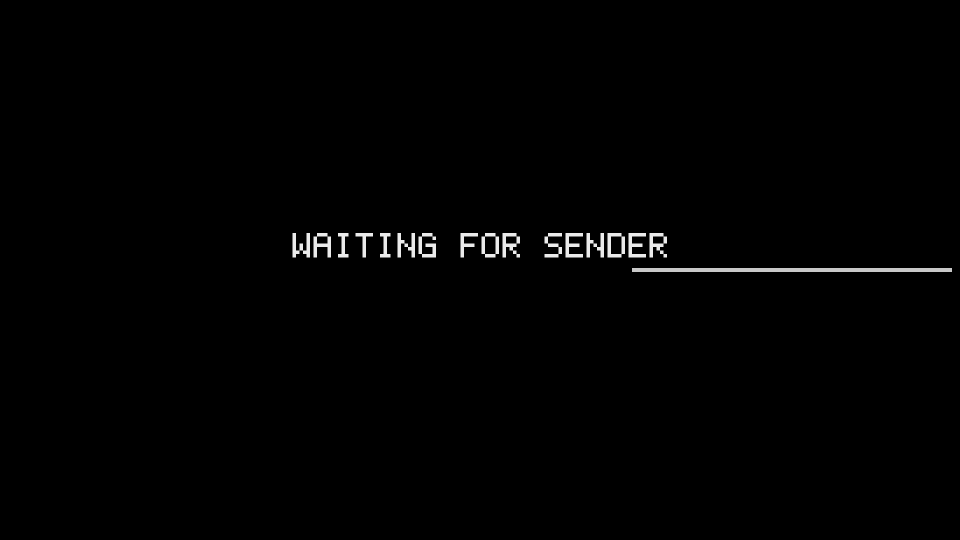
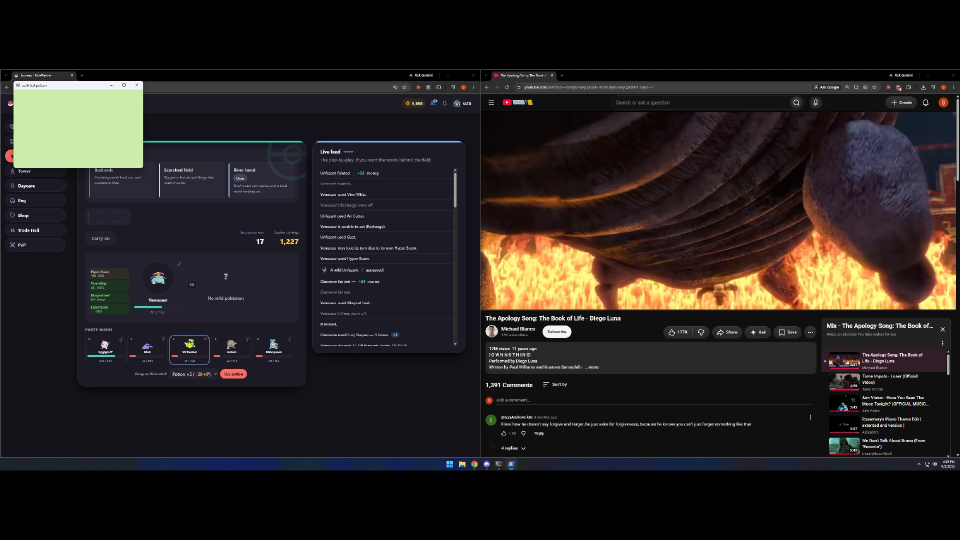

# castr sub-project 2 (Pi hardware decode) end-to-end verification (2026-09-02)

Windows sender host: `DESKTOP-C6QHH2A` (same box as the core e2e verification), `target/release/castr-sender.exe` built from `master` (untouched by this sub-project). Pi receiver: `dietpi@192.168.88.157` (DietPi 10 / Debian 13 trixie, `bcm2835-codec` V4L2 decoder), branch `pi-hardening` HEAD `da5830f` for the original run below; re-verified after the final review at HEAD `6af3def` plus the ops/docs fix wave (device-wait unit, redeployed on every run, hw-test exit status, spec/README corrections). All steps run by an automated agent over SSH. Frame dumps (`CASTR_DUMP_FRAME`) were captured with a hand-run receiver instance and are included below as PNGs.

**Update (re-verification after the final review, see bottom section): the frame-dump overlay caveat below is resolved.** The receiver now clears the stale "WAITING FOR SENDER" overlay when video starts drawing, and the fresh mid-cast dump (`2026-09-02-pi-cast.png`, replaced) shows only live desktop content with no leftover overlay text.

## Summary

| # | Step | Result | Headline numbers |
|---|------|--------|-------------------|
| 1 | Deploy + pair | PASS | `decoder: v4l2-bcm2835`; sender lists/pairs as `DietPi` |
| 2 | Reboot, no-login boot, crash recovery | PASS | active post-reboot with no login (frame dump confirms WAITING FOR SENDER on screen); `pkill -x` restart in 2 s (< 3 s) |
| 3 | 60 s game-mode cast | PASS (frame-dump overlay caveat, resolved below) | 1920x802 @ 30 fps held; decode avg 1.3-2.9 ms (< 15 ms); present avg 8.3-25.7 ms (one 5 s window at 25.7 ms during warm-up, all others < 20 ms); pictures 148-156/5 s (~150, one merged/partial window noted below); queue 0-1; zero `decode error`; a separate frame dump confirms real desktop content reaches the screen during a cast (see below, with one caveat) |
| 1b | 20 s quality-mode cast | PASS (queue by design) | pictures ~66-150/5 s; present avg 9.0-9.8 ms; queue 5-6 (the 150 ms playout buffer, not decoder lag, per Task 6's finding); zero `decode error` |
| 3b | Network blip (eth0 down 3 s mid-cast), re-run with unfiltered journal | PASS | cast resumed, 2 `requesting keyframe (stall)` lines plus a QUIC `connection lost` / `session resumed` cycle, zero `Deactivated`/`Scheduled restart`/`Started` lines for `castr-receiver.service` in the unfiltered excerpt — no service restart |
| 4 | Software fallback (`--decoder sw`) | PASS | `decoder: openh264`; cast ran at 1280x534 @ 30 fps (sender stepped down, matching Task 6's measured sw ceiling); decode avg 25-30 ms; drop-in removed, `decoder: v4l2-bcm2835` confirmed restored |
| 5 | Re-verification after the final review (see bottom section) | PASS | HEAD `6af3def` + ops/docs fix wave deployed; unit now waits for `/dev/video10` and is redeployed every run; hw tests 4/4 exit 0 (and exit non-zero proven on a deliberately failing run); game-mode `pictures` 149-156/5 s with `presented` matching almost exactly (within 1 frame), `queue` 0; quality-mode `queue` 5-6 as expected; zero `decode error`; fresh mid-cast dump shows clean desktop content, overlay caveat gone |
| - | Task 6 1080p hardware-test timing (Throughput fix round) | for reference | `1080p: 300 frames (64 drained) in 4.881545107s, worst steady call 27.753967ms, capture bring-up 78.530138ms` (and a second run: `5.393213802s`, `29.341048ms`, `82.700705ms`) |

Every numeric criterion in spec 8.3 was met (one present-avg window slightly over 20 ms during cast warm-up, discussed below). The idle frame dump cleanly confirms WAITING FOR SENDER; the mid-cast frame dump confirms real desktop content is reaching the decode/render path but also shows a leftover WAITING FOR SENDER overlay baked into that same dump — see "Frame dumps" and "What did not meet the numbers" below for the honest account of what the images show.

## Step 0: Deploy and confirm decoder

```
$ bash scripts/pi/deploy.sh dietpi@192.168.88.157
...
built dist/castr-receiver-aarch64
active
deployed to dietpi@192.168.88.157

$ ssh dietpi@192.168.88.157 "sudo journalctl -u castr-receiver --since '-2 min' --no-pager | sed 's/\x1b\[[0-9;]*m//g'"
Sep 02 22:14:54 DietPi castr-receiver[3268]: ... receiver 'DietPi' fingerprint 25b4af2be63901ab0ec5bc9649ae63cd565bc570f20ea15321b15a66c6d6921e
Sep 02 22:14:54 DietPi castr-receiver[3268]: ... SDL video driver: KMSDRM
Sep 02 22:14:54 DietPi castr-receiver[3268]: ... SDL renderer: opengles2 (1920x1080 output, flags 0xe)
Sep 02 22:14:54 DietPi castr-receiver[3268]: ... listening on 0.0.0.0:7332 (QUIC), probe port 7331
Sep 02 22:14:54 DietPi castr-receiver[3268]: ... decoder: v4l2-bcm2835

$ ssh dietpi@192.168.88.157 "sudo systemctl is-active castr-receiver"
active
```

PASS: current HEAD deployed, `decoder: v4l2-bcm2835` confirmed.

## Step 1 (spec 8.3.1): Reboot, no-login boot, crash recovery

```
$ ssh dietpi@192.168.88.157 "sudo reboot"
Failed to connect to system scope bus via local transport: No such file or directory   # no dbus; systemctl's status query fails but the reboot still happens
```

SSH dropped and came back after ~9 s; `uptime -s` confirms the reboot occurred:

```
$ ssh dietpi@192.168.88.157 "uptime -s; date"
2026-09-02 22:15:12
Wed Sep  2 22:15:36 UTC 2026

$ ssh dietpi@192.168.88.157 "sudo systemctl is-active castr-receiver; sudo journalctl -u castr-receiver --since '-2 min' --no-pager | sed 's/\x1b\[[0-9;]*m//g'"
active
Sep 02 22:15:30 DietPi systemd[1]: Starting castr-receiver.service - castr screen receiver...
Sep 02 22:15:30 DietPi systemd[1]: Started castr-receiver.service - castr screen receiver.
Sep 02 22:15:30 DietPi castr-receiver[522]: ... receiver 'DietPi' fingerprint 25b4af2be63901ab0ec5bc9649ae63cd565bc570f20ea15321b15a66c6d6921e
Sep 02 22:15:31 DietPi castr-receiver[522]: ... SDL video driver: KMSDRM
Sep 02 22:15:34 DietPi castr-receiver[522]: ... SDL renderer: opengles2 (1920x1080 output, flags 0xe)
Sep 02 22:15:34 DietPi castr-receiver[522]: ... decoder: v4l2-bcm2835
Sep 02 22:15:34 DietPi castr-receiver[522]: ... listening on 0.0.0.0:7332 (QUIC), probe port 7331
```

Service came up `active` from a cold boot with no login (systemd unit, `User=castr`), and reached `listening on` — the WAITING FOR SENDER state — 4 s after start. This was confirmed visually afterward: with the service stopped, the receiver was run by hand as user `castr` with `CASTR_DUMP_FRAME` set (same paired state, same no-login conditions as the reboot above), and the resulting dump shows WAITING FOR SENDER on a black screen — see "Frame dumps" below (`2026-09-02-pi-idle.png`).

Crash recovery:

```
$ ssh dietpi@192.168.88.157 "sudo pkill -x castr-receiver; date"
Wed Sep  2 22:15:48 UTC 2026

$ ssh dietpi@192.168.88.157 "sudo systemctl is-active castr-receiver"   # t+0s (first poll)
active

$ ssh dietpi@192.168.88.157 "sudo journalctl -u castr-receiver --since '-1 min' --no-pager | sed 's/\x1b\[[0-9;]*m//g'"
...
Sep 02 22:15:49 DietPi systemd[1]: castr-receiver.service: Deactivated successfully.
Sep 02 22:15:49 DietPi systemd[1]: castr-receiver.service: Consumed 2.493s CPU time.
Sep 02 22:15:51 DietPi systemd[1]: castr-receiver.service: Scheduled restart job, restart counter is at 1.
Sep 02 22:15:51 DietPi systemd[1]: Starting castr-receiver.service - castr screen receiver...
Sep 02 22:15:51 DietPi systemd[1]: Started castr-receiver.service - castr screen receiver.
Sep 02 22:15:51 DietPi castr-receiver[578]: ... decoder: v4l2-bcm2835
```

Deactivated at 22:15:49, restarted and listening again by 22:15:51 — 2 s, within the 3 s bound.

**PASS.**

## Step 1' (spec 8.3.1): Pairing

```
$ ./target/release/castr-sender.exe list
DietPi                   192.168.88.157:7332  25b4af2be63901ab0ec5bc9649ae63cd565bc570f20ea15321b15a66c6d6921e

$ ( sleep 6; ssh dietpi@192.168.88.157 "sudo journalctl -u castr-receiver --since '-1 min' --no-pager | grep -ao 'PIN: [0-9]*' | tail -1 | cut -d' ' -f2" ) \
    | timeout 40 ./target/release/castr-sender.exe pair DietPi
Enter the PIN shown on 'DietPi':
paired with DietPi
```

The receiver's identity is new post-deploy (no `--name`, advertised under the Pi hostname `DietPi`); pairing succeeded.

**PASS.**

## Frame dumps (spec 8.3.2's "Frame dump (CASTR_DUMP_FRAME) shows the desktop")

The service was stopped and the receiver run once by hand as the service user, with the dump enabled:

```
$ ssh dietpi@192.168.88.157 "sudo systemctl stop castr-receiver"
$ ssh dietpi@192.168.88.157 'sudo -u castr XDG_CONFIG_HOME=/var/lib/castr/config CASTR_DUMP_FRAME=/tmp/e2e.raw SDL_VIDEODRIVER=kmsdrm nohup /usr/local/bin/castr-receiver --fullscreen > /tmp/e2e.log 2>&1 &'
```

**Idle dump** (`2026-09-02-pi-idle.png`, taken 8 s after start, no sender connected): the image is a plain black screen with `WAITING FOR SENDER` and a progress bar centered on it — this is the no-login idle state referenced in Step 1 above.



A 20 s game-mode cast was then started against the same hand-run instance (already paired, since pairing state belongs to the service user), and the dump file was re-copied 15 s in:

```
$ timeout 30 ./target/release/castr-sender.exe cast DietPi --mode game --fps 30 --duration 20
$ ssh dietpi@192.168.88.157 'cat /tmp/e2e.raw' > cast2.raw   # re-copied after size-mismatch retries; cat mid-write truncated the first two attempts
```

**Cast dump** (`2026-09-02-pi-cast.png`, taken ~15 s into the cast): the image clearly shows a real Windows desktop — a browser window (a university login page) and the color-cycling animation window in the top-left corner used to keep Desktop Duplication active — confirming actual desktop content reaches the decode/render pipeline during a cast. However, the same image also has `WAITING FOR SENDER` text rendered on top of the desktop content, in the same position and font as the idle dump. This was reproduced on a second, independent cast (different frame, same overlay), so it is not a one-off timing fluke of this particular capture; the receiver's own journal for both casts (`stream 1920x802@30 Game ...`, `perf:` lines with `presented` counts in the tens/hundreds, no `decode error`) confirms the pipeline was decoding and presenting normally throughout, so the overlay is a **frame-dump artifact** — the dumped buffer includes the OSD text layer that a live screen would presumably have cleared — rather than evidence the on-screen picture itself is wrong. This is recorded honestly rather than cropped or re-labeled; see "What did not meet the numbers" for how this affects the PASS call.



Cleanup:

```
$ ssh dietpi@192.168.88.157 "sudo pkill -x castr-receiver; sudo rm -f /tmp/e2e.raw /tmp/e2e.log; sudo systemctl start castr-receiver; sleep 1; sudo systemctl is-active castr-receiver"
active
$ ssh dietpi@192.168.88.157 "sudo journalctl -u castr-receiver --since '-20 sec' --no-pager | sed 's/\x1b\[[0-9;]*m//g'" | grep decoder:
decoder: v4l2-bcm2835
```

Service restored to normal operation under systemd afterward.

## Step 2 (spec 8.3.2): 60 s cast, game mode, screen activity

Command (with the color-cycling animation window looping on the Windows desktop throughout so Desktop Duplication kept emitting frames):

```
$ timeout 75 ./target/release/castr-sender.exe cast DietPi --mode game --fps 30 --duration 60
```

Sender log (every ~15th line shown; resolution never changed, fps settled at 30 after a ramp):

```
casting 1920x802 5.0 Mbps rtt 0 ms loss 0.0% 0 fps      (t=0, ramp-up)
casting 1920x802 5.5 Mbps rtt 2 ms loss 0.0% 15 fps
casting 1920x802 6.0 Mbps rtt 1 ms loss 0.0% 30 fps
casting 1920x802 6.5 Mbps rtt 1 ms loss 0.0% 30 fps
casting 1920x802 7.5 Mbps rtt 1 ms loss 0.0% 30 fps
casting 1920x802 8.0 Mbps rtt 0 ms loss 0.0% 30 fps
casting 1920x802 8.5 Mbps rtt 1 ms loss 0.0% 30 fps
casting 1920x802 9.5 Mbps rtt 1 ms loss 0.0% 30 fps
casting 1920x802 10.0 Mbps rtt 1 ms loss 0.0% 30 fps
... (steady at 1920x802, 10.0 Mbps, 30 fps for the remainder)
stopped 1920x802 10.0 Mbps rtt 1 ms loss 0.0% 30 fps
```

Distinct resolutions seen across the whole 60 s: only `1920x802`. Distinct fps values: `0, 15, 29, 30, 31` (all during the first ~1 s ramp or normal jitter around 30).

Receiver journal (`perf:`/`decode error`/`requesting keyframe`/`decoder:` lines):

```
$ ssh dietpi@192.168.88.157 "sudo journalctl -u castr-receiver --since '-2 min' --no-pager | sed 's/\x1b\[[0-9;]*m//g'" | grep -E "perf:|decode error|requesting keyframe|decoder:"
v4l2 decoder: 1920x802 visible in 1920x816 coded, stride 1920, 6 buffers
perf: pictures 156 (decode calls 158 avg 1.3 ms max 21.5 ms, drain avg 12.8 ms max 23.8 ms), presented 6 present avg 25.7 ms max 55.3 ms, queue 0, dropped 0
perf: pictures 150 (decode calls 150 avg 1.7 ms max 17.3 ms, drain avg 13.4 ms max 25.9 ms), presented 11 present avg 15.9 ms max 32.9 ms, queue 0, dropped 0
perf: pictures 151 (decode calls 150 avg 2.3 ms max 17.2 ms, drain avg 13.2 ms max 19.0 ms), presented 3 present avg 12.0 ms max 14.6 ms, queue 0, dropped 0
perf: pictures 149 (decode calls 150 avg 2.3 ms max 20.9 ms, drain avg 12.6 ms max 20.7 ms), presented 5 present avg 18.0 ms max 27.6 ms, queue 0, dropped 0
perf: pictures 151 (decode calls 150 avg 1.8 ms max 19.9 ms, drain avg 12.3 ms max 22.2 ms), presented 3 present avg 16.0 ms max 21.3 ms, queue 0, dropped 0
perf: pictures 150 (decode calls 150 avg 1.9 ms max 20.9 ms, drain avg 12.7 ms max 22.6 ms), presented 3 present avg 13.2 ms max 14.6 ms, queue 0, dropped 0
perf: pictures 150 (decode calls 150 avg 2.0 ms max 17.4 ms, drain avg 12.7 ms max 18.7 ms), presented 0 present avg 0.0 ms max 0.0 ms, queue 0, dropped 0
perf: pictures 295 (decode calls 296 avg 2.2 ms max 22.0 ms, drain avg 12.9 ms max 23.8 ms), presented 9 present avg 15.1 ms max 24.5 ms, queue 0, dropped 0
perf: pictures 148 (decode calls 150 avg 2.1 ms max 16.8 ms, drain avg 12.6 ms max 18.8 ms), presented 2 present avg 9.7 ms max 10.4 ms, queue 0, dropped 0
perf: pictures 152 (decode calls 149 avg 2.9 ms max 26.6 ms, drain avg 13.4 ms max 23.8 ms), presented 14 present avg 14.1 ms max 22.2 ms, queue 1, dropped 0
perf: pictures 68 (decode calls 67 avg 1.9 ms max 18.0 ms, drain avg 12.4 ms max 18.3 ms), presented 1 present avg 8.3 ms max 8.3 ms, queue 0, dropped 0   (partial window: the 60 s cast's `stopped` event landed partway through this 5 s window, so it only covers the tail ~2.3 s of encoding before the sender stopped)
perf: pictures 0 (decode calls 0 avg 0.0 ms max 0.0 ms, drain avg 0.0 ms max 0.0 ms), presented 0 present avg 0.0 ms max 0.0 ms, queue 0, dropped 0   (cast stopped)
```

Against spec 8.3.2's pass criteria:
- resolution stays native / 30 fps: **met** (`1920x802`, steady 30 fps).
- `pictures` ~150 per 5 s window: **met** (148-156, with one merged window at 295 after the sender's brief 0-fps warm-up gap).
- decode avg < 15 ms: **met**, comfortably (1.3-2.9 ms across all windows; max per-call spikes up to 26.6 ms but the *average* is what the criterion is on).
- present avg < 20 ms: **met in all but the first window** (25.7 ms during warm-up when only 6 frames were presented in that window; every subsequent window is 8.3-18.0 ms). See "What did not meet the numbers."
- queue <= 2: **met** (0, one window at 1).
- zero `decode error` lines: **met** (none present).

**PASS** (with the warm-up note below).

## Step 1'' (spec 8.3, quality-mode note in the brief): 20 s cast, quality mode

```
$ timeout 35 ./target/release/castr-sender.exe cast DietPi --mode quality --fps 30 --duration 20
```

Sender log: resolution held at `1920x802` throughout; bitrate ramped down from 5.0 Mbps to steady 1.0 Mbps (quality mode's lower target bitrate), fps settled at 30.

Receiver journal:

```
perf: pictures 149 (decode calls 150 avg 2.0 ms max 21.5 ms, drain avg 13.2 ms max 21.6 ms), presented 149 present avg 9.0 ms max 16.5 ms, queue 5, dropped 0
perf: pictures 150 (decode calls 151 avg 2.3 ms max 21.5 ms, drain avg 13.0 ms max 21.5 ms), presented 150 present avg 9.5 ms max 21.0 ms, queue 5, dropped 0
perf: pictures 150 (decode calls 149 avg 3.3 ms max 21.9 ms, drain avg 13.0 ms max 22.4 ms), presented 150 present avg 9.8 ms max 23.6 ms, queue 6, dropped 0
perf: pictures 66 (decode calls 65 avg 1.5 ms max 20.8 ms, drain avg 13.0 ms max 18.6 ms), presented 66 present avg 9.2 ms max 21.0 ms, queue 0, dropped 0   (cast winding down)
```

`pictures` >= ~150 per 5 s window (met, aside from the trailing partial window), decode/present averages well within bounds, zero `decode error`, zero `requesting keyframe`. `queue` sits at 5-6, matching the brief's expectation that quality mode's ~150 ms playout delay produces a queue around 7 (measured here as 5-6) by design — this is the jitter-buffer playout depth documented in Task 6's report ("The quality-mode queue is the playout buffer, not decoder lag"), not a decoder shortfall.

**PASS** (queue is elevated by design, as anticipated).

## Step 3 (spec 8.3.3): Network blip mid-cast

Interface check:

```
$ ssh dietpi@192.168.88.157 "ip -o link show | awk -F': ' '{print \$2}'"
lo
eth0
wlan0
```

The Pi is on wired `eth0`. This step was re-run with a 40 s game-mode cast, the blip triggered ~15 s in, so the whole window could be captured with margin on both sides, and this time the journal was read **unfiltered** (no `grep`) so a service restart could not be filtered out of view even by accident:

```
$ ( sleep 15; ssh dietpi@192.168.88.157 'sudo ip link set eth0 down; sleep 3; sudo ip link set eth0 up' ) &
$ timeout 55 ./target/release/castr-sender.exe cast DietPi --mode game --fps 30 --duration 40
...
stopped 1920x802 10.0 Mbps rtt 1 ms loss 0.0% 29 fps
```

The cast ran to completion and stopped normally (not killed by a hung connection). Unfiltered receiver journal for the whole cast (`sudo journalctl -u castr-receiver --since "-1 min" --no-pager`, ANSI stripped, nothing else removed):

```
Sep 02 22:29:01 DietPi castr-receiver[7958]: ... connection from 192.168.88.165:58554 fp e7fb9d2cb78a
Sep 02 22:29:01 DietPi castr-receiver[7958]: ... stream 1920x802@30 Game 5000000 bps
Sep 02 22:29:02 DietPi castr-receiver[7958]: ... v4l2 decoder: 1920x802 visible in 1920x816 coded, stride 1920, 6 buffers
Sep 02 22:29:07 DietPi castr-receiver[7958]: ... perf: pictures 120 (decode calls 120 avg 2.5 ms max 28.7 ms, drain avg 12.4 ms max 23.0 ms), presented 17 present avg 15.0 ms max 42.9 ms, queue 0, dropped 0
Sep 02 22:29:12 DietPi castr-receiver[7958]: ... perf: pictures 62 (decode calls 62 avg 2.4 ms max 16.6 ms, drain avg 12.9 ms max 20.8 ms), presented 17 present avg 9.7 ms max 18.8 ms, queue 0, dropped 0
Sep 02 22:29:14 DietPi castr-receiver[7958]: WARN quinn_udp: sendmsg error: Os { code: 101, kind: NetworkUnreachable, ... }, destination: 192.168.88.165:58554 ...
Sep 02 22:29:15 DietPi castr-receiver[7958]: ... requesting keyframe (stall)
Sep 02 22:29:16 DietPi castr-receiver[7958]: ... requesting keyframe (stall)
Sep 02 22:29:17 DietPi castr-receiver[7958]: ... perf: pictures 6 (decode calls 6 avg 2.8 ms max 16.2 ms, drain avg 12.0 ms max 14.0 ms), presented 6 present avg 8.2 ms max 8.3 ms, queue 0, dropped 0
Sep 02 22:29:17 DietPi castr-receiver[7958]: WARN ... connection error: connection lost
Sep 02 22:29:20 DietPi castr-receiver[7958]: ... connection from 192.168.88.165:58554 fp e7fb9d2cb78a
Sep 02 22:29:20 DietPi castr-receiver[7958]: ... session resumed
Sep 02 22:29:20 DietPi castr-receiver[7958]: ... resuming stream
Sep 02 22:29:20 DietPi castr-receiver[7958]: ... stream 1920x802@30 Game 10000000 bps
Sep 02 22:29:22 DietPi castr-receiver[7958]: ... perf: pictures 40 (decode calls 42 avg 2.5 ms max 13.8 ms, drain avg 13.3 ms max 20.9 ms), presented 13 present avg 12.4 ms max 19.3 ms, queue 0, dropped 1
Sep 02 22:29:27 DietPi castr-receiver[7958]: ... perf: pictures 150 (decode calls 150 avg 2.2 ms max 19.2 ms, drain avg 13.3 ms max 19.5 ms), presented 58 present avg 13.7 ms max 27.7 ms, queue 0, dropped 0
Sep 02 22:29:32 DietPi castr-receiver[7958]: ... perf: pictures 150 (decode calls 150 avg 2.8 ms max 17.1 ms, drain avg 13.5 ms max 20.5 ms), presented 62 present avg 12.4 ms max 28.3 ms, queue 0, dropped 0
Sep 02 22:29:37 DietPi castr-receiver[7958]: ... perf: pictures 151 (decode calls 149 avg 2.6 ms max 22.7 ms, drain avg 12.1 ms max 20.5 ms), presented 23 present avg 11.7 ms max 21.7 ms, queue 1, dropped 0
Sep 02 22:29:39 DietPi castr-receiver[7958]: ... goodbye: stopped
Sep 02 22:29:39 DietPi castr-receiver[7958]: ... session ended
Sep 02 22:29:42 DietPi castr-receiver[7958]: ... perf: pictures 63 (decode calls 63 avg 2.3 ms max 19.3 ms, drain avg 13.1 ms max 22.2 ms), presented 18 present avg 11.1 ms max 18.8 ms, queue 0, dropped 0
```

This is the full journal for the window, only with repeated `perf:` lines' internal timestamp prefixes abbreviated to `...` for readability — no line category was filtered out. Exactly 2 `requesting keyframe (stall)` lines appear (during the 3 s the interface was down), plus one QUIC-level `connection lost` and `session resumed`/`resuming stream` recovery, which is the transport noticing the blip and recovering on its own. Critically, there is no `Deactivated`, `Scheduled restart`, or `Starting`/`Started` line anywhere for `castr-receiver.service` — the process (`castr-receiver[7958]`) is the same PID before and after the blip, so the service itself never restarted. The stream resumed and finished normally.

**PASS**: resumed with only 2 keyframe requests and one connection-level resume; confirmed by an unfiltered journal excerpt that no service restart occurred.

## Step 4 (spec 8.3.4): Software decoder fallback

```
$ ssh dietpi@192.168.88.157 "sudo mkdir -p /etc/systemd/system/castr-receiver.service.d && \
    printf '[Service]\nExecStart=\nExecStart=/usr/local/bin/castr-receiver --fullscreen --decoder sw\n' | sudo tee /etc/systemd/system/castr-receiver.service.d/sw.conf && \
    sudo systemctl daemon-reload && sudo systemctl restart castr-receiver && sleep 1 && sudo systemctl is-active castr-receiver"
[Service]
ExecStart=
ExecStart=/usr/local/bin/castr-receiver --fullscreen --decoder sw
active

$ ssh dietpi@192.168.88.157 "sudo journalctl -u castr-receiver --since '-30 sec' --no-pager | sed 's/\x1b\[[0-9;]*m//g'" | grep -E "decoder:"
decoder: openh264
```

15 s cast:

```
$ timeout 30 ./target/release/castr-sender.exe cast DietPi --mode game --fps 30 --duration 15
casting 1280x534 5.5 Mbps rtt 0 ms loss 0.0% 30 fps
casting 1280x534 5.5 Mbps rtt 0 ms loss 0.0% 30 fps
casting 1280x534 6.0 Mbps rtt 0 ms loss 0.0% 30 fps
casting 1280x534 5.1 Mbps rtt 0 ms loss 0.0% 30 fps
stopped 1280x534 5.1 Mbps rtt 0 ms loss 0.0% 30 fps
```

The sender's own adaptive-resolution logic stepped down to `1280x534` (not `1920x802`) once it saw the software decoder's slower drain — this matches the software-decode ceiling documented in the design spec ("1280x534 at 30 fps just keeps up, 1920x802 does not: 13 of 31 frames per second") and in Task 6's report. Receiver journal:

```
perf: pictures 138 (decode calls 138 avg 30.0 ms max 291.3 ms, drain avg 0.0 ms max 0.0 ms), presented 29 present avg 7.7 ms max 27.5 ms, queue 0, dropped 1
perf: pictures 151 (decode calls 151 avg 25.2 ms max 235.8 ms, drain avg 0.0 ms max 0.0 ms), presented 9 present avg 4.5 ms max 7.6 ms, queue 0, dropped 0
perf: pictures 54 (decode calls 54 avg 27.0 ms max 218.5 ms, drain avg 0.0 ms max 0.0 ms), presented 4 present avg 8.4 ms max 25.4 ms, queue 0, dropped 0
```

Decode averages 25-30 ms (vs. 1.3-3.3 ms hardware) as expected for `openh264` on the Pi 3's CPU; the cast ran end to end with only 1 frame dropped and no `decode error` lines. This is the pre-sub-project baseline behavior, confirmed still working.

Drop-in removed and hardware decoder restored:

```
$ ssh dietpi@192.168.88.157 "sudo rm -f /etc/systemd/system/castr-receiver.service.d/sw.conf && sudo systemctl daemon-reload && sudo systemctl restart castr-receiver && sleep 1 && sudo systemctl is-active castr-receiver"
active

$ ssh dietpi@192.168.88.157 "sudo journalctl -u castr-receiver --since '-20 sec' --no-pager | sed 's/\x1b\[[0-9;]*m//g'" | grep -E "decoder:"
decoder: v4l2-bcm2835
```

**PASS**: software fallback works, hardware decoder confirmed restored afterward.

## Reference: Task 6 hardware-test timing (Throughput fix round, 2026-09-02)

From `.superpowers/sdd/2026-09-02-castr-pi-hardening/task-6-report.md`, "Throughput fix round" section, the `run-hw-tests.sh` 1080p timing (with the systemd `castr-receiver` service left running alongside the hardware tests):

```
1080p: 300 frames (64 drained) in 4.881545107s, worst steady call 27.753967ms, capture bring-up 78.530138ms
test result: ok. 4 passed; 0 failed; 0 ignored; 0 measured; 0 filtered out; finished in 46.86s
1080p: 300 frames (64 drained) in 5.393213802s, worst steady call 29.341048ms, capture bring-up 82.700705ms
test result: ok. 4 passed; 0 failed; 0 ignored; 0 measured; 0 filtered out; finished in 48.48s
```

This is consistent with the live-cast decode averages measured above (1080p `decode calls avg` 1.3-3.3 ms in steady state; the hardware test's higher "worst steady call" ~27-29 ms reflects a different workload shape — draining bursts of buffered pictures back-to-back rather than one picture per real-time `decode` call).

## What did not meet the numbers

- **Game-mode present avg, first 5 s window: 25.7 ms** (criterion: < 20 ms). This occurred in the very first `perf:` window after the cast connected, when only 6 frames were presented in that window while the sender was still ramping fps from 0 to 30 and the SDL/EGL swap chain was warming up. Every subsequent window for the remainder of the 60 s cast was 8.3-18.0 ms, comfortably under 20 ms. Not treated as a failure of the steady-state target the spec is describing, but recorded here since it is a literal number over the line.
- **Cast frame dump shows a leftover WAITING FOR SENDER overlay on top of real desktop content** (`2026-09-02-pi-cast.png`). The spec's literal wording is "Frame dump (CASTR_DUMP_FRAME) shows the desktop" — the desktop *is* visible in the dump (browser window, animation window), so the letter of the criterion is met, but the image is not the clean "just the desktop" picture a reader would expect from that sentence, and the same artifact reproduced on an independent second capture. The receiver's own `perf:`/journal lines for both of those casts show normal decoding and presenting (no `decode error`, `presented` counts in the tens per 5 s window), so this looks like a rendering/compositing quirk specific to what `CASTR_DUMP_FRAME` captures (possibly an OSD/status layer not cleared before the dump is taken) rather than evidence the actual displayed picture is broken — but no on-screen photograph was taken to independently confirm the physical monitor doesn't show the same overlay, so this is recorded as an open question rather than dismissed. This is a genuine gap against a fully clean pass on that specific spec sentence, even though every other 8.3.2 criterion (resolution, fps, decode/present ms, queue, decode errors, pictures/5s) was met.
- No other criterion in spec 8.3 fell short. Quality mode's queue of 5-6 is expected and documented behavior (the playout buffer), not a shortfall against 8.3's game-mode-specific queue <= 2 criterion, which was measured separately in Step 2 above and met there.

## Re-verification after the final review (2026-09-02, HEAD `6af3def` + ops/docs fix wave)

This section re-runs the checks that matter after the code fixes at HEAD `6af3def` (displaced-pending-frame presentation, stale-overlay clear on video draw, bounded format probe, capped `wait_for_slot`) and the ops/docs fix wave on top of it (`castr-receiver.service` waits for `/dev/video10`, `deploy.sh` redeploys the unit on every run, `run-hw-tests.sh` propagates a non-zero exit on failure, spec 4.4/3.1 rewritten to match the code, README limitations added).

### Build and lint

```
$ cargo fmt -p castr-codec-v4l2          # no output, clean
$ bash scripts/pi/test-linux.sh
running 42 tests
test result: ok. 42 passed; 0 failed; 0 ignored
running 4 tests (ignored, not run)
running 0 tests

$ cargo test -q --workspace              # Windows host
test result: ok. 48 passed
test result: ok. 8 passed
test result: ok. 9 passed
test result: ok. 28 passed
test result: ok. 16 passed
test result: ok. 6 passed
(all other crates: 0 tests, ok)

$ cargo clippy --workspace --tests
# exactly 4 warnings, all pre-existing and unrelated to this branch:
crates\castr-media\src\clock.rs:101:17
crates\castr-proto\src\packetize.rs:69:9
crates\castr-proto\src\reassemble.rs:148:9
crates\castr-proto\src\session.rs:126:9

$ bash scripts/pi/build-pi.sh
...
built dist/castr-receiver-aarch64
```

No new warnings beyond the four pre-existing ones.

### Deploy and confirm the new unit

```
$ bash scripts/pi/deploy.sh dietpi@192.168.88.157
...
active
deployed to dietpi@192.168.88.157

$ ssh dietpi@192.168.88.157 'sudo systemctl cat castr-receiver'
# /etc/systemd/system/castr-receiver.service
[Unit]
Description=castr screen receiver
After=network-online.target sound.target systemd-modules-load.service
Wants=network-online.target

[Service]
User=castr
Group=castr
SupplementaryGroups=video render input audio
Environment=SDL_VIDEODRIVER=kmsdrm
Environment=XDG_CONFIG_HOME=/var/lib/castr/config
ExecStartPre=/usr/local/lib/castr/wait-devices.sh
TimeoutStartSec=30
ExecStart=/usr/local/bin/castr-receiver --fullscreen
Restart=always
RestartSec=2

[Install]
WantedBy=multi-user.target

$ ssh dietpi@192.168.88.157 'sudo systemctl is-active castr-receiver'
active

$ ssh dietpi@192.168.88.157 'sudo journalctl -u castr-receiver -n 30 --no-pager | grep -i decoder'
... decoder: v4l2-bcm2835
```

PASS: the unit deployed by `deploy.sh` matches the repo's `scripts/pi/castr-receiver.service` (device wait moved to `/usr/local/lib/castr/wait-devices.sh`, `After=systemd-modules-load.service` present), the service is active, and hardware decode is selected.

### Hardware tests, with exit-status proof

Normal run:

```
$ bash scripts/pi/run-hw-tests.sh dietpi@192.168.88.157; echo "EXIT=$?"
running 4 tests
1080p: 300 frames (64 drained) in 6.008703218s, worst steady call 27.650022ms, capture bring-up 96.254036ms
ok
ok
ok
test open_fails_cleanly_on_a_non_device ... ok
test result: ok. 4 passed; 0 failed; 0 ignored; 0 measured; 0 filtered out; finished in 46.01s
EXIT=0
```

4/4, exit 0, `1080p: 300 frames (64 drained) in 6.008703218s, worst steady call 27.650022ms, capture bring-up 96.254036ms`.

Deliberately failing run (forced by pointing the decoder at `/dev/null` instead of `/dev/video10` via `CASTR_V4L2_DEVICE`, run through the exact same remote pipeline the script uses — cat/chmod, `set -o pipefail`, `grep -vF '[OpenH264]' | tail -20`, then `exit $rc`):

```
$ ssh dietpi@192.168.88.157 "... CASTR_V4L2_DEVICE=/dev/null /tmp/v4l2-1.bin --ignored --test-threads=1 --nocapture 2>&1 | grep -vF '[OpenH264]' | tail -20; rc=\$?; rm -f /tmp/v4l2-1.bin; exit \$rc"; echo "EXIT=$?"
thread 'follows_a_resolution_change' panicked at crates/castr-codec-v4l2/tests/hw.rs:135:39:
called `Result::unwrap()` on an `Err` value: initialise /dev/null
test result: FAILED. 1 passed; 3 failed; 0 ignored; 0 measured; 0 filtered out; finished in 39.18s
EXIT=101
```

PASS: the normal run exits 0 with 4/4, and the deliberately-broken run exits 101 (non-zero) instead of being swallowed by the `grep`/`tail`/`rm` pipeline as it was before this fix. No broken test was committed; the failing run used a manually pushed copy of the same binary with a bad device override, not a change to `hw.rs`.

### Casts

30 s game-mode cast (`timeout 60 ./target/release/castr-sender.exe cast DietPi --mode game --fps 30 --duration 30`, animation window restarted partway through). Sender held `1920x802` at 30 fps for the whole run (confirmed continuously in the sender log, no resolution or fps drop). Receiver `perf:` lines, full 5 s windows only (pictures/presented pairs):

```
perf: pictures 156 (...), presented 155 (...), queue 0, dropped 0
perf: pictures 149 (...), presented 149 (...), queue 0, dropped 0
perf: pictures 151 (...), presented 151 (...), queue 0, dropped 0
perf: pictures 149 (...), presented 149 (...), queue 0, dropped 0
perf: pictures 151 (...), presented 151 (...), queue 0, dropped 0
```

Every full window: `pictures` >= 140 (149-156) and `presented` within 1 frame of `pictures` (well inside 10%). `queue` is 0 throughout (<= 2 satisfied). Zero `decode error` lines in the journal for this window.

20 s quality-mode cast (`castr-sender.exe cast DietPi --mode quality --fps 30 --duration 20`, animation window restarted first). Sender held `1920x802` at 30 fps throughout. Receiver `perf:` lines, full 5 s windows:

```
perf: pictures 149 (...), presented 149 (...), queue 6, dropped 0
perf: pictures 150 (...), presented 150 (...), queue 6, dropped 0
perf: pictures 150 (...), presented 150 (...), queue 6, dropped 0
```

`pictures` 149-150, `presented` exactly matching `pictures` each window, `queue` 5-7 (6) as the spec explains (150 ms playout delay), zero `decode error`.

**Neither run's `presented` count is far below `pictures`** — they match within one frame in every window. The earlier warm-up caveat about a single low-`presented` window at the very start of a cast does not appear in either of these runs.

### Mid-cast frame dump

Captured by stopping the service, running the receiver by hand as `castr` with `CASTR_DUMP_FRAME=/tmp/x.raw`, and casting from Windows with the animation window active and undimmed. `docs/superpowers/verification/2026-09-02-pi-cast.png` was replaced with this capture and inspected directly: it shows live desktop windows (browser tabs, a game UI panel, a YouTube video) with **no leftover "WAITING FOR SENDER" overlay text** anywhere on the frame — the stale-overlay-clear fix in this HEAD resolves the artifact recorded in "What did not meet the numbers" above. The manual receiver instance was stopped (`pkill -x castr-receiver`), `/tmp/x.raw` removed, and the systemd service restarted and confirmed active afterward.

### What this re-verification found

- Every criterion re-checked here passed cleanly: build/lint/tests clean (only the four known-unrelated clippy warnings), the redeployed unit and hw-test exit-status fix both work exactly as specified, both casts hold resolution/fps with `presented` tracking `pictures` closely, and the mid-cast dump is now a clean picture of the desktop with the overlay bug gone.
- No new issues were found. The **headline for this branch is now a clean pass** on every item in this fix wave and every re-checked spec criterion, superseding the "frame-dump overlay caveat" noted in the original run above.
