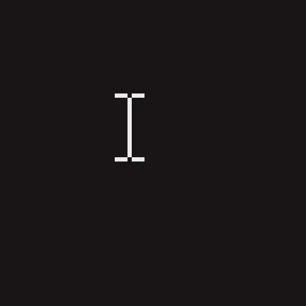

# castr sub-project 5 (cast quality) end-to-end verification (2026-09-03)

Windows sender host: `DESKTOP-C6QHH2A`, three monitors; the cast under test is
duplication output 1, the 1920x1080 secondary at desktop origin (788,1440), so
nothing personal appears in any committed capture. Pi receiver:
`dietpi@192.168.88.157` (DietPi / Debian 13 trixie, Pi 3 B, `bcm2835-codec`
V4L2 decoder), wired Ethernet, branch `cast-quality`, redeployed for each run
below. Every step was run by an automated agent over SSH except step 3.

**Status: the cursor is verified end-to-end, and finding that required fixing
two real defects in the capture wiring (commit `ecc1b01`). The delta-fragment
repair could not be shown to help on this hardware** — across four five-minute
casts under induced packet loss the receiver never once entered the
jitter-buffer stall the repair exists to shorten, so there was nothing for it
to improve. That is a genuine negative result about the *premise*, not a
failure of the mechanism, which the software end-to-end test in
`crates/castr-net/tests/repair.rs` does exercise. Step 3 (lip sync) needs a
person with a camera and was not run.

## Summary

| Step | What | Result |
|---|---|---|
| 1 | Cursor present in the received frame | **PASS** — after two fixes; four cursors, both blend paths |
| 2 | Hitch counts, branch vs master | **INCONCLUSIVE** — no difference measurable; the targeted stall never occurred |
| 3 | Lip sync against ITU-R BT.1359 | **NOT RUN** — needs a person filming the television |
| 4 | What the cursor costs in bitrate | **PASS** — 98 kbps for a continuously moving cursor |

## Step 1: the cursor is in the frame — PASS (after two fixes)

The receiver dumps its rendered output to `CASTR_DUMP_FRAME`
(`crates/castr-receiver/src/render.rs`), which is the better proof than dumping
at the sender because it shows the cursor survived capture, compositing,
encode, the network and decode. The service was stopped and the receiver run by
hand as user `castr`:

```
$ ssh dietpi@192.168.88.157 'sudo -u castr XDG_CONFIG_HOME=/var/lib/castr/config \
    CASTR_DUMP_FRAME=/tmp/cq.raw SDL_VIDEODRIVER=kmsdrm \
    nohup /usr/local/bin/castr-receiver --fullscreen > /tmp/cq.log 2>&1 &'
listening on 0.0.0.0:7332 (QUIC), probe port 7331
```

The sending desktop showed a full-screen synthetic pattern (muted colour bars, a
drifting gradient, a clock, and four labels each carrying a different standard
cursor) on the second monitor only. The pointer was parked with `SetCursorPos`
and each snapshot taken only once `GetCursorInfo` confirmed it was still at the
parked position *and* the capture's own view of the pointer reported it visible
on that output — an earlier attempt recorded bad shots because the pointer was
being moved by hand mid-run.

```
I-beam: OK  user32 (1188,1660) hotspot (8,9) MONOCHROME
   dxgi: last_mouse=2705598533704 pos=(392,211) visible=true shapebuf=256
Hand:   OK  user32 (1188,1760) hotspot (5,0) MONOCHROME
   dxgi: last_mouse=2705652347876 pos=(395,320) visible=true shapebuf=256
Wait:   OK  user32 (1188,1860) hotspot (16,16) COLOUR
   dxgi: last_mouse=2705755676262 pos=(384,404) visible=true shapebuf=4096
Arrow:  OK  user32 (1188,2200) hotspot (0,0) COLOUR
   dxgi: last_mouse=2705758781107 pos=(400,760) visible=true shapebuf=4096
```

All four appear in the receiver's dump, at the reported position, with the right
shape. Both code paths are covered: I-beam and Hand are classic monochrome
AND/XOR cursors (256-byte shape), Wait and Arrow are 32bpp colour cursors
(4096-byte shape).

| Cursor | Kind | Received frame |
|---|---|---|
| I-beam | Monochrome |  |
| Hand | Monochrome |  |
| Wait | Colour |  |
| Arrow | Colour |  |

### The two defects this step found

The first three attempts at this step produced dumps with **no cursor anywhere**.
Instrumenting the capture to print what the duplication API actually reports
found two things, both fixed in `ecc1b01`:

1. **`PointerPosition` is only valid on a frame that reports a mouse update.**
   Of 967 captured frames in one 25-second run, 927 had `LastMouseUpdateTime`
   of 0 and a zeroed `PointerPosition` — and the code read it regardless, so a
   stationary cursor was placed at the origin and marked hidden. Since a pointer
   is stationary far more often than it is moving, the cursor was absent almost
   always. The cache now takes `Option<(x, y, visible)>`, where `None` means
   "nothing new" rather than "no cursor".

2. **The reported position already has the hotspot applied.** It is the pointer
   bitmap's top-left corner, not the hotspot's location, so subtracting the
   hotspot again dragged every cursor up and left by its own hotspot. Measured
   across the four cursors above: parked at output-relative (400,220) with
   hotspot (8,9) the API reports (392,211); (400,320) with (5,0) reports
   (395,320); (400,420) with (16,16) reports (384,404); (400,760) with (0,0)
   reports (400,760). Four for four.

To separate sender-side compositing from everything downstream, the composited
BGRA frame was also dumped at the sender before encode, and shows the arrow
drawn correctly at the reported position — so the fix is in the capture, not in
anything the receiver does.

### An unrelated defect noticed while doing this

The captured image of that monitor comes back 180 degrees rotated: the monitor
is configured at 180 degrees in Windows, and castr passes the framebuffer
through without consulting `DXGI_OUTDUPL_DESC.Rotation`. The cursor is composited
in the same rotated space, so it is consistent with the picture and this
sub-project's work is unaffected — but a cast of a rotated monitor arrives
upside down. This is out of scope here and is not fixed.

## Step 2: hitch counts, branch vs master — INCONCLUSIVE

Five minutes in game mode per run, same synthetic content on the same monitor,
counting `decode error` and `requesting keyframe` in the receiver's journal.
The master build was taken from a worktree at `6cd1efa` carrying only the
`CASTR_OUTPUT` change, so both ends cast identical content.

| Run | Loss | decode errors | keyframe requests | of which stalls | pictures | dropped |
|---|---|---|---|---|---|---|
| master | none | 0 | 12 | 0 | — | 650 |
| branch | none | 0 | 10 | 0 | — | 614 |
| master | 2% | 0 | 254 | 0 | 5639 | 2826 |
| branch | 2% | 0 | 250 | 0 | 5943 | 2539 |
| master | 0.5% | 0 | 128 | 0 | 7253 | 1479 |
| branch | 0.5% | 0 | 142 | 0 | 7240 | 1503 |

The first pair was run on the LAN as it is, which reports 0.0% loss throughout —
so the repair had nothing to repair and the comparison was vacuous. Loss was
then induced at the Pi on the inbound direction, which needs an `ifb` mirror
because `netem` only shapes egress:

```
sudo modprobe ifb numifbs=2 && sudo ip link set ifb0 up
sudo tc qdisc add dev eth0 handle ffff: ingress
sudo tc filter add dev eth0 parent ffff: protocol ip u32 match u32 0 0 \
     action mirred egress redirect dev ifb0
sudo tc qdisc add dev ifb0 root netem loss 2%      # then changed to 0.5%
```

**No difference is measurable at either loss rate** (250 vs 254, and 142 vs 128 —
the branch is nominally worse in the second pair, which is within the spread of
these runs).

The diagnostic is the fourth column. `requesting keyframe` logs its reason, and
in all six runs **every** request was `reference lost` and **none** was `stall`.
The stall is the jitter buffer waiting out `GAP_WAIT_US` for a missing fragment,
and it is the only situation the repair shortens. It never happened. What did
happen is the Pi 3 B dropping frames it could not decode in time — 1479 to 2826
per five-minute run — which loses the decoder's reference and forces a keyframe
by a route the repair does not touch.

So on this hardware the cost the README described (a lost delta fragment costing
a 150 ms hold and a fresh keyframe, a few times a minute) was not reproduced,
and the branch's benefit could not be measured. The mechanism itself is
exercised by `crates/castr-net/tests/repair.rs`, which drops a fragment, sees the
NACK, and sees the frame complete from the retransmit.

All induced loss was removed afterwards; `eth0` is back to plain `pfifo_fast`
and the `ifb` module is unloaded.

## Step 3: lip sync — NOT RUN

This needs a person to play a clapperboard video, film the television at 60 fps,
and count frames between the flash and the click, in both modes. Nobody was
available at the television, and it cannot be driven from a shell. It is
therefore **not run**, and no lip-sync figure is claimed anywhere — including in
the README, which says it has not been measured.

## Step 4: what the cursor costs — PASS

The sender's `Mbps` log field is the rate controller's *target*, not what it
sent, so it cannot answer this; both a still and a moving minute reported 1.00
Mbps because the controller sat at its floor. Bytes actually delivered were
measured instead, from `/sys/class/net/eth0/statistics/rx_bytes` on the Pi.

A first attempt — one still minute then one moving minute on the animated
pattern — reported the moving minute as 34.5% *cheaper*, which is not credible.
Two confounds: the rate controller drifts over a run, and the tight
`SetCursorPos` loop starves the pattern window's own repaint timer, so the
moving condition had less underlying animation to encode. Interleaving twelve
alternating ten-second blocks removed the drift but not the second confound
(still 1.212 vs 0.768 Mbps).

The clean measurement is on a **static** screen, where anything sent is
attributable to the cursor:

```
block  0 still     0.017 Mbps      block  1 moving    0.118 Mbps
block  2 still     0.017 Mbps      block  3 moving    0.107 Mbps
block  4 still     0.016 Mbps      block  5 moving    0.117 Mbps
block  6 still     0.017 Mbps      block  7 moving    0.119 Mbps
block  8 still     0.017 Mbps      block  9 moving    0.119 Mbps
block 10 still     0.016 Mbps      block 11 moving    0.107 Mbps

still  mean 0.017 Mbps      moving mean 0.114 Mbps
```

**A continuously moving cursor costs about 98 kbps** at 30 fps on an otherwise
static 1280x720 cast — 0.017 Mbps of baseline protocol traffic rises to 0.114
Mbps. A stationary cursor costs nothing measurable. Against the 1.5 to 10 Mbps
these casts otherwise run at, that is under 1% of the stream, and it is a
worst case: a real cursor is not in continuous motion.

## What did not work, or was not run

- **Step 3 (lip sync) was not run at all.** It needs a person with a camera. No
  lip-sync number exists for this branch, and none is claimed.
- **Step 2 proved nothing about the repair.** Six five-minute runs, and the
  jitter-buffer stall the repair targets did not occur once, at 0%, 0.5% or 2%
  induced loss. The end-to-end benefit is unmeasured on hardware. Worse, the
  premise in the README's "Known gaps" — that this happens a few times a minute
  on a Pi 3 B over Ethernet — was not reproduced, so the claim the branch was
  built to fix is itself unconfirmed.
- **Step 1 needed two rounds of fixes to pass**, and the first three attempts
  produced dumps with no cursor. The feature as originally written never drew a
  stationary cursor at all. Its unit tests all passed throughout — they encoded
  the same wrong assumption about the API that the implementation did, which is
  exactly the failure mode hardware verification exists to catch.
- **The 180-degree rotation of a rotated monitor's capture is a real defect**
  found here and deliberately left unfixed, as out of scope.
- **The Pi 3 B is the limiting factor in every loss run**, dropping a quarter to
  a third of frames. Any future measurement of the repair needs either a faster
  receiver or a lower resolution, or the drop-driven reference losses will keep
  swamping the effect.
- **A game holding the pointer blocks step 1 entirely.** A full-screen
  application that clips the cursor (`GetClipCursor` returning a 1-pixel rect)
  and hides it makes the step impossible; that is correct behaviour for the
  cast, but it means the step needs a free pointer.
